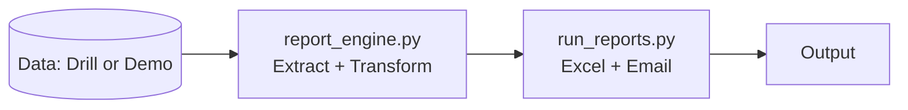
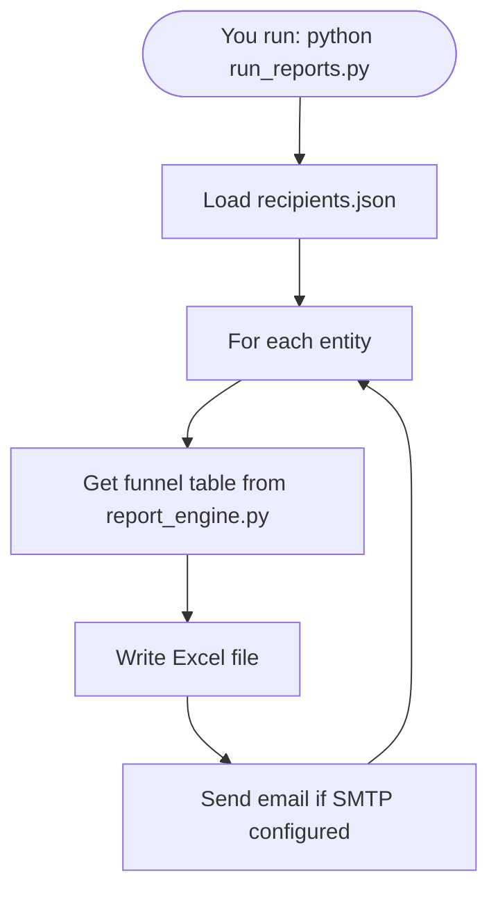
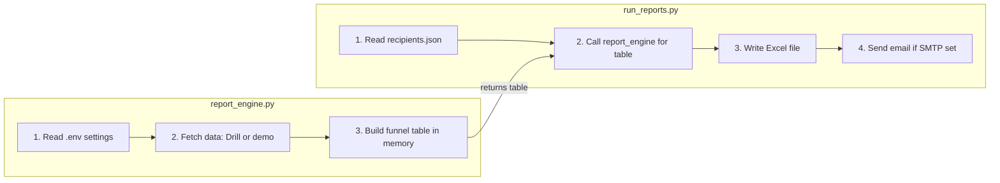

# Funnel Report ETL Pipeline

**Automated ETL pipeline** that extracts user-funnel data from a query engine (Apache Drill), transforms it into a staged funnel with success/dropoff metrics, and loads formatted Excel reports (with optional email delivery). Built for daily analytics reporting.

*Portfolio project. See [DISCLAIMER.md](DISCLAIMER.md).*

---

## Problem

Business needs **daily funnel reports** per entity: stage-by-stage counts, dropoff reasons (OTP, discovery, consent, FI fetch), and percentages. Data lives in **CSV files** queried via **Apache Drill**. Reports must be **Excel** (formatted for stakeholders) and optionally **emailed** to entity-specific recipients.

## Solution

A single **ETL pipeline** that:

1. **Extract** — Query Drill for four datasets (funnel stages, OTP summary, discovery summary, FI fetch status) per entity and date.
2. **Transform** — Aggregate stages, join breakdowns, compute success/dropoff counts and % of initial users.
3. **Load** — Write a formatted Excel dashboard and optionally send it via SMTP.

Configuration is **env-based** (no secrets in code). Entity → recipient mapping is **config-driven** (JSON). The pipeline supports **single day**, **month**, or **date range**.

---

## Architecture

**One pipeline, two files:**



| Step | Who | What |
|------|-----|------|
| 1 | **report_engine.py** | Gets raw data (Drill or demo), builds funnel table (counts & %). |
| 2 | **run_reports.py** | Writes Excel, sends email, handles `--demo` / `--date`. |

Data flows left to right. You only run `run_reports.py`; it calls `report_engine.py` to get the table.

---

## What each Python file does (in simple words)

### `report_engine.py` — **Get the data and turn it into the report table**

This file does the **data work**:

1. **Read settings** — Gets Drill server address, output folder, and email settings from your `.env` file.
2. **Fetch data** — Talks to Apache Drill (or uses fake data in demo mode) and brings back four things: funnel stage counts, OTP summary, discovery summary, and FI fetch status. Think of it as “pulling the raw numbers from the database.”
3. **Build the funnel table** — Takes those raw numbers and works out how many users reached each step, how many dropped off, and what percentage that is. The result is one table (rows and columns) ready to be written to Excel.

So: **report_engine.py = get data + do the math → one report table.**

---

### `run_reports.py` — **Run the pipeline, write Excel, and send email**

This file does the **orchestration and output**:

1. **Read who gets reports** — Loads `recipients.json` to know which entity gets which email addresses (To and CC).
2. **For each entity** — Calls `report_engine` to get the funnel table, then writes that table to an Excel file with nice formatting (colors, column widths).
3. **Optional email** — If you configured SMTP in `.env`, it attaches the Excel file and sends it to the right people.
4. **Command-line options** — When you run `python run_reports.py`, you can add `--demo` (use fake data, no Drill) or `--date` (pick a specific date).

So: **run_reports.py = “run everything,” write Excel, send email, handle --demo and --date.**

---

### How they work together



---

### Side-by-side: report_engine.py vs run_reports.py



| | **report_engine.py** | **run_reports.py** |
|---|----------------------|---------------------|
| **Role** | Data & math | Orchestrate & output |
| **Input** | .env, Drill (or demo) | recipients.json, funnel table from report_engine |
| **Work** | Fetch raw data → aggregate → build table (counts, %) | For each entity: get table → write .xlsx → email |
| **Output** | Funnel table (in memory) | Excel file(s), emails |
| **You run?** | No (called by run_reports) | Yes: `python run_reports.py` |

**In one sentence:**

| File | Does this |
|------|-----------|
| **report_engine.py** | Gets data (Drill or demo) and builds the funnel table. |
| **run_reports.py** | Runs the script, calls report_engine, writes Excel, sends email. |

---

### Build funnel table vs Write Excel — what’s the difference?

| | Build funnel table *(report_engine.py)* | Write Excel *(run_reports.py)* |
|---|----------------------------------------|--------------------------------|
| **What it is** | Prepares the **numbers and layout** of the report **in memory** (inside the program). No file is created yet. | Takes that prepared table and **saves it as a real .xlsx file** you can open in Excel. |
| **Analogy** | Like writing the report on a **draft sheet**: you have all the rows, columns, counts, and percentages ready. | Like **printing** that draft and saving it as a file so others can open it. |
| **Output** | A table (rows & columns) in Python — used by the next step. | A file on disk, e.g. `output/demo_funnel_report-15_02_2026.xlsx`. |

So: **build = do the math and arrange the data; write = save it as an Excel file.**

---

## Tech Stack

| Layer        | Technology |
|-------------|------------|
| Query / Extract | Apache Drill (REST API), SQL over CSV |
| Process     | Python 3, pandas |
| Export      | xlsxwriter (formatted Excel) |
| Delivery    | SMTP (optional) |
| Config      | Environment variables, JSON (recipients) |

---

## Quick Start

### Try it in 30 seconds (no Drill or .env needed)

```bash
git clone <repo-url>
cd funnel-report-etl-pipeline
pip install -r requirements.txt
python run_reports.py --demo
```

This generates **`output/demo_funnel_report-<date>.xlsx`** using **mock data** so you can see the pipeline and output without any backend.

### Run with real data

1. Copy `.env.example` to `.env` and set `DRILL_HOST`, `DRILL_PORT`, `DRILL_DATA_BASE` (and optionally SMTP, `OUTPUT_DIR`).
2. Edit `recipients.json` with your entity IDs and To/CC emails.
3. Run:

```bash
python run_reports.py
# Or for a specific date:
python run_reports.py --date 15_02_2026
```

Reports are written to `OUTPUT_DIR` (default `./output`) and emailed per `recipients.json` if SMTP is configured.

---

## Project Structure

```
funnel-report-etl-pipeline/
├── README.md
├── DISCLAIMER.md
├── requirements.txt
├── .env.example
├── recipients.json           # entity_id → To / CC (config-driven)
├── report_engine.py          # Extract (Drill) + Transform (funnel table)
├── run_reports.py            # Load (Excel, email) + CLI (--demo, --date)
├── docs/
│   ├── CONFIGURATION.md
│   └── DATA_SOURCES.md
└── samples/
    └── SAMPLE_OUTPUT.md      # What the Excel report looks like
```

---

## Design Decisions

- **ETL separation**: Extract (Drill) and Transform (funnel logic) live in `report_engine.py`; Load (Excel, email) and orchestration in `run_reports.py`. Clear single responsibility.
- **Config outside code**: Drill and SMTP settings from env; entity → recipients from JSON. No hardcoded credentials or recipient lists.
- **Demo mode**: `--demo` runs the full Transform + Load with synthetic data so the project is runnable and reviewable without a Drill instance (e.g. in interviews or portfolio review).
- **Date flexibility**: Pipeline supports single day (`dd_mm_yyyy`), full month (`*mm_yyyy`), or range (`dd_mm_yyyy -> dd_mm_yyyy`) for ad-hoc or backfill runs.
- **Error handling**: Per-entity try/except so one failing entity does not stop the rest; empty Drill result skips that entity with a message.

---

## Sample Output

The Excel workbook has one sheet, **Funnel Dashboard**: summary metrics at the top, then a table of stages with success counts, dropoff counts, and % of initial users (with subcauses for OTP, discovery, consent). See [samples/SAMPLE_OUTPUT.md](samples/SAMPLE_OUTPUT.md) for a text snapshot.

---

## Configuration

| Env / File       | Purpose |
|------------------|---------|
| `DRILL_HOST`, `DRILL_PORT`, `DRILL_DATA_BASE` | Where to query funnel CSVs |
| `OUTPUT_DIR`     | Directory for generated Excel files |
| `SMTP_*`         | Optional; omit to skip email |
| `recipients.json`| `to`: entity → list of To emails; `cc`: entity → CC list, plus `default` |

See [docs/CONFIGURATION.md](docs/CONFIGURATION.md) and [docs/DATA_SOURCES.md](docs/DATA_SOURCES.md) for details.

---

## License / Disclaimer

Portfolio use only. See [DISCLAIMER.md](DISCLAIMER.md).
